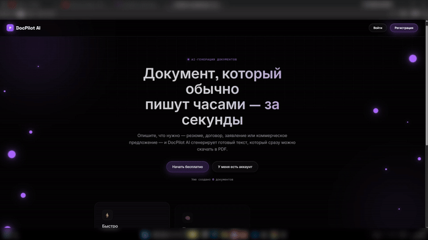

# DocPilot AI

<p align="center">
  
</p>

<p align="center">
  
  
  
  
</p>

**AI-powered document generator** — resumes, contracts, applications, and business proposals, generated locally in seconds. Full auth system, referral program, PDF export, and a dark-neon UI. No external API costs — runs entirely on a local LLM.

🔗 **[Live demo](https://docpilotai.onrender.com)** &nbsp;•&nbsp; 🎥 **[60-sec walkthrough](#)**

> ⚠️ Free-тариф Render засыпает при простое — первая загрузка может занять до 50 секунд.

---

## Why this project

Most "AI wrapper" projects are a single API call behind a form. DocPilot AI is a full product: session-based auth, rate limiting, CSRF protection, password recovery, a referral system, and a monetization path — built as if it were shipping to real users, not a tutorial.

## Stack

| Layer | Choice | Why |
|---|---|---|
| Backend | Python 3 + Flask | Lightweight, explicit control over routes/security |
| AI | Ollama (`llama3.2:3b`, local) | Zero per-request cost, no API key dependency |
| Database | SQLite (raw `sqlite3`, no ORM) | Transparent queries, easy to audit |
| Auth | Flask sessions + `werkzeug.security` | Hashed passwords, no plaintext anywhere |
| Security | `flask-wtf` (CSRF), `flask-limiter` (rate limits), secure cookies, security headers | Production-minded from day one |
| PDF | `reportlab` + DejaVu Sans | Full Cyrillic support in exports |
| Frontend | Jinja2 + vanilla CSS/JS | No build step — readable and easy to extend |

## Features

- Registration / login / email-based password recovery
- AI document generation with edit & delete
- One-click PDF export
- Usage limits (5 free generations/account) + Pro tier scaffold (payment provider plug-and-play)
- Referral system — unique code per user, bonus generations for invites
- Document search, responsive layout, OG tags for social sharing

## Quickstart

```bash
pip install flask flask-wtf flask-limiter reportlab ollama python-dotenv
ollama pull llama3.2:3b

cp .env.example .env        # fill in FLASK_SECRET_KEY (see comments in the file)
python app.py                # → http://127.0.0.1:5000
```

## Project structure

```
app.py                — all Flask routes / application logic
database.py            — SQLite data layer
static/css/style.css   — full design system (dark neon theme)
static/js/main.js      — shared scripts
templates/             — Jinja2 templates (base.html = shared layout)
fonts/                  — Cyrillic-capable font for PDF export
```

## Before deploying to production

- Swap the Flask dev server for a WSGI server (gunicorn/waitress)
- Ollama needs ≥4GB RAM — consider a cloud LLM API on cheap VPS tiers
- Set `FLASK_DEBUG=False`

## Roadmap

- [ ] Real payment provider on `/pro` (Stripe / YooKassa)
- [ ] PostgreSQL migration path for scale
- [ ] Optional cloud-LLM fallback for higher-quality generation

---

<details>
<summary>🇷🇺 Читать на русском</summary>

## DocPilot AI

AI-сервис для генерации документов (резюме, договоры, заявления, коммерческие предложения) с личным кабинетом, лимитами на бесплатном тарифе, реферальной системой и экспортом в PDF. Работает полностью на локальной модели — без затрат на внешние API.

**Стек:** Python 3 + Flask · Ollama (`llama3.2:3b`) · SQLite · Flask sessions + `werkzeug.security` · CSRF/rate-limiting/security headers · `reportlab` (PDF с кириллицей) · Jinja2 + vanilla CSS/JS

**Функционал:** регистрация/логин, восстановление пароля по email, генерация документов через AI с редактированием, PDF-экспорт, лимит 5 бесплатных генераций + заглушка Pro-тарифа, реферальная система, поиск по документам, адаптивный дизайн.

**Установка:**
```bash
pip install flask flask-wtf flask-limiter reportlab ollama python-dotenv
ollama pull llama3.2:3b
cp .env.example .env   # заполнить FLASK_SECRET_KEY
python app.py           # → http://127.0.0.1:5000
```

**Перед продакшеном:** заменить dev-сервер на gunicorn/waitress, учесть требование Ollama к RAM (≥4GB), выставить `FLASK_DEBUG=False`.

</details>
